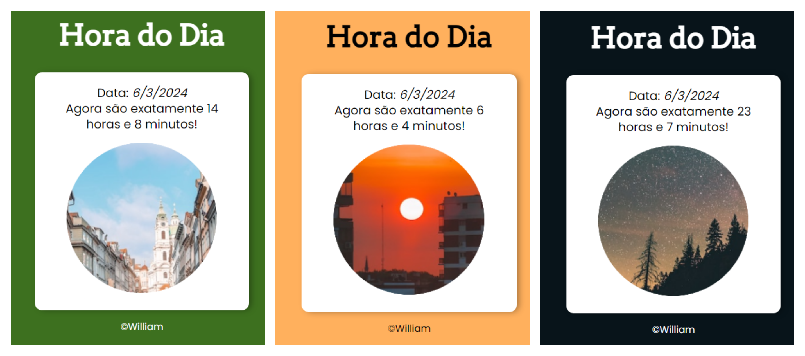

# 🕣 Hora do Dia - Site Interativo 
Bem-vindo ao Hora do Dia, um site interativo que exibe a hora do dia de acordo com o horário local em que você entra no site. Além disso, o fundo do site muda de cor de acordo com a hora, criando uma experiência visual única!

## Como funciona? 🤔
Ao acessar o site, ele automaticamente detectará a hora local do seu dispositivo. A cor de fundo também será alterada para uma tonalidade correspondente à hora do dia: cores mais vivas durante o dia e cores mais escuras durante a noite.

 </img>

***Contribuições são bem-vindas! Se você tem ideias para melhorar o design, adicionar recursos ou otimizar o código, siga as etapas: Faça um fork deste repositório; Faça as alterações no seu fork; Envie um pull request para análise.***

🧠 Feito por williamcouto | Licença: MIT
